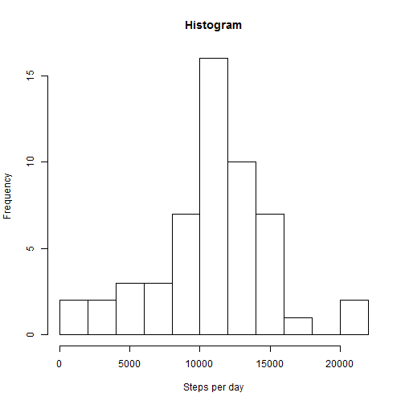
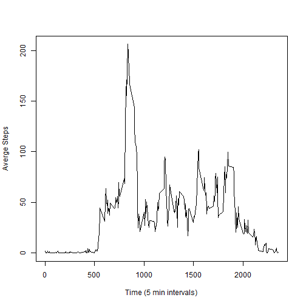
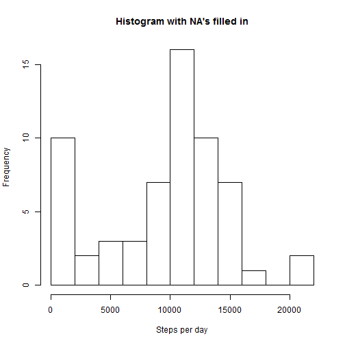
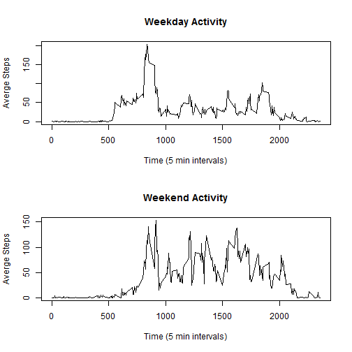

## What is mean total number of steps taken per day?
* Load the data (i.e. read.csv())
* Process/transform the data (if necessary) into a format suitable for your analysis
* Calculate the total number of steps taken per day


```r
    repro_dat<-read.csv("I:/activity.csv")
    library(reshape)
    repro_dat_agg<-aggregate(steps~date, repro_dat, sum)
    head(repro_dat_agg, 5)
```

```
##         date steps
## 1 2012-10-02   126
## 2 2012-10-03 11352
## 3 2012-10-04 12116
## 4 2012-10-05 13294
## 5 2012-10-06 15420
```

* If you do not understand the difference between a histogram and a barplot, research the difference between them. Make a histogram of the total number of steps taken each day

```r
    hist(x=repro_dat_agg$steps, xlab="Steps per day", main = "Histogram", breaks = 10)
```

 

* Calculate and report the mean and median of the total number of steps taken per day

```r
    median(repro_dat_agg$steps)
```

```
## [1] 10765
```

```r
    mean(repro_dat_agg$steps)    
```

```
## [1] 10766.19
```

## What is the average daily activity pattern?
* Make a time series plot (i.e. type = "l") of the 5-minute interval (x-axis) and the average number of steps taken, averaged across all days (y-axis)

```r
    repro_dat_agg1<-aggregate(steps~interval,repro_dat,mean)
    plot(y=repro_dat_agg1$steps, x=repro_dat_agg1$interval, type="l", xlab = "Time (5 min intervals)", ylab="Averge Steps")
```

 


* Which 5-minute interval, on average across all the days in the dataset, contains the maximum number of steps?

```r
    subset(repro_dat_agg1, subset= repro_dat_agg1$steps ==max(repro_dat_agg1$steps))
```

```
##     interval    steps
## 104      835 206.1698
```

## Inputing missing values
* Note that there are a number of days/intervals where there are missing values (coded as NA). The presence of missing days may introduce bias into some calculations or summaries of the data.
* Calculate and report the total number of missing values in the dataset (i.e. the total number of rows with NAs)

```r
    sum(is.na(repro_dat$steps))
```

```
## [1] 2304
```

* Devise a strategy for filling in all of the missing values in the dataset. The strategy does not need to be sophisticated. 
* The mean for that 5-minute interval is used
* Create a new dataset that is equal to the original dataset but with the missing data filled in.


```r
    repro_dat_new <- repro_dat
    for (i in 1:nrow(repro_dat_new)){
        if(is.na(repro_dat$steps[i])){
            repro_dat_new$steps[i]<-repro_dat_agg1[which(repro_dat_agg1$interval == 0),]$step
        }
    }
```


* Make a histogram of the total number of steps taken each day and Calculate and report the mean and median total number of steps taken per day. Do these values differ from the estimates from the first part of the assignment? What is the impact of imputing missing data on the estimates of the total daily number of steps?

```r
    repro_dat_new_agg<-aggregate(steps~date, repro_dat_new, sum)
    hist(x=repro_dat_new_agg$steps, xlab="Steps per day", main = "Histogram with NA's filled in", breaks = 10)
```

 

```r
    rbind(c("", "median", "mean"),
    c("old",median(repro_dat_agg$steps), mean(repro_dat_agg$steps)),
    c("new",median(repro_dat_new_agg$steps), mean(repro_dat_new_agg$steps)))
```

```
##      [,1]  [,2]     [,3]              
## [1,] ""    "median" "mean"            
## [2,] "old" "10765"  "10766.1886792453"
## [3,] "new" "10395"  "9419.08072997216"
```

## Are there differences in activity patterns between weekdays and weekends?

```r
    repro_dat_new$DaysOfWeek <- weekdays(as.Date(repro_dat_new$date))
    repro_dat_new$DaysOfWeek <- as.factor(repro_dat_new$DaysOfWeek)
    levels(repro_dat_new$DaysOfWeek) <- c("weekday", "weekday", "weekend", "weekend", "weekday", "weekday", "weekday")
    repro_dat_new_agg1<-aggregate(steps~interval,subset(repro_dat_new, subset= repro_dat_new$DaysOfWeek=="weekday"),mean)
    repro_dat_new_agg2<-aggregate(steps~interval,subset(repro_dat_new, subset= repro_dat_new$DaysOfWeek=="weekend"),mean)
    par(mfcol=c(2,1))
    plot(y=repro_dat_new_agg1$steps, x=repro_dat_new_agg1$interval, type="l", xlab = "Time (5 min intervals)", ylab="Averge Steps", main="Weekday Activity")
    plot(y=repro_dat_new_agg2$steps, x=repro_dat_new_agg2$interval, type="l", xlab = "Time (5 min intervals)", ylab="Averge Steps", main="Weekend Activity")
```

 
